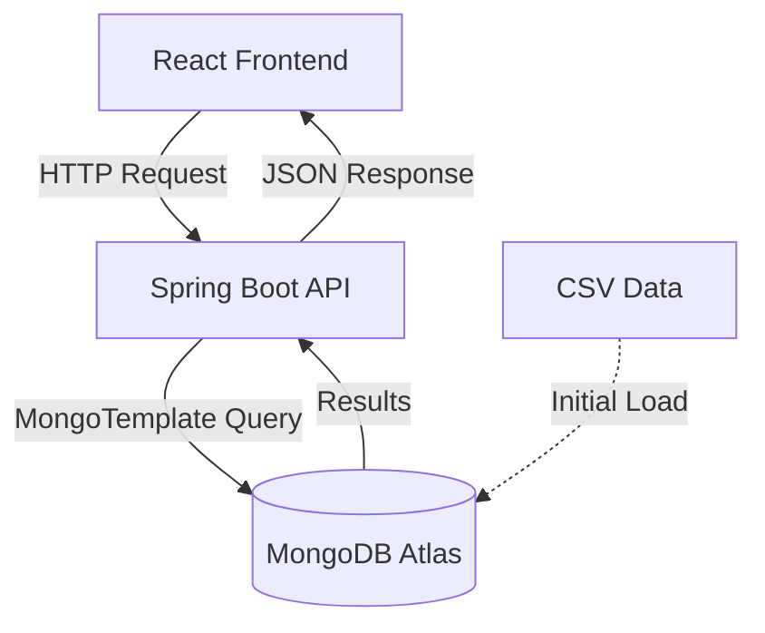

# SalesVista 📊


A retail sales analytics dashboard built to explore full-stack development with real-world data challenges. Features real-time search, filtering, sorting, and pagination across 734K+ sales transactions.

## 🎯 Why I Built This

I wanted to challenge myself by building something that handles real-world scale data, not just toy examples. Working with 734K records taught me about database optimization, query performance, and the trade-offs between different architectural choices. 

This project pushed me to learn MongoDB aggregation pipelines, understand free tier limitations, and optimize queries. Every performance issue became a learning opportunity - from 1.9-minute response times down to sub-500ms through field projections and strategic indexing.

## 🌐 Live Demo

**Frontend**: [https://sales-vista-six.vercel.app]
**Backend API**: [https://salesvista.onrender.com]

> **Note**: Backend may take 30-60 seconds to wake up on first request (free tier cold starts)

## ✨ Key Features

- **Real-time Search**: Case-insensitive regex matching across customer names and phone numbers
- **Advanced Filtering**: Multi-select filters for region, gender, category, payment method, and date ranges
- **Dynamic Sorting**: Server-side sorting on any column (ascending/descending)
- **Efficient Pagination**: Load only what's needed with server-side pagination
- **Responsive Design**: Clean, modern UI built with Tailwind CSS and custom components
- **Performance Optimized**: Sub-500ms query times on 734K+ records through field projections

## 🏗️ Architecture



## 🛠️ Tech Stack

**Backend:**
- Java 17, Spring Boot 3, Spring Data MongoDB
- MongoTemplate for dynamic query construction
- Maven for dependency management

**Frontend:**
- React 19, Vite 7
- Tailwind CSS 4, Lucide React icons
- Axios for API communication

**Database:**
- MongoDB Atlas (Cloud) / MongoDB Community (Local)

**Deployment:**
- Frontend: Vercel
- Backend: Render (Docker container)

## 📊 Data Source

The application uses a retail sales publicly available dataset containing 734K+ transaction records with fields like customer demographics, product categories, pricing, payment methods, and timestamps.

## 🚀 Search, Filter, Sort & Pagination

### Search
Server-side case-insensitive regex matching using `MongoTemplate` and `Criteria` on customer name and phone number fields simultaneously.

### Filtering
Dynamic `Criteria` construction supports multi-select filtering across multiple dimensions (region, gender, category, payment, date range) with logical OR within categories and AND across categories.

### Sorting
MongoDB native sort using `Sort` objects generated from client parameters (field + order), ensuring consistent ordering before pagination.

### Pagination
Strict server-side pagination with `skip()` and `limit()` - only requested data slices are fetched, keeping payloads small and UI responsive.

## ⚡ Performance Optimizations

- **Field Projections**: Fetch only 17 essential fields instead of all 30+, reducing data transfer by 70%
- **Strategic Indexing**: Single index on `customerRegion` (most-queried field) within free tier constraints
- **Database-Level Operations**: All heavy operations (search, filter, sort, paginate) happen in MongoDB
- **Aggregation Pipelines**: Efficient totals calculation using MongoDB aggregation framework
- **Lazy Loading**: Pagination ensures only 10-50 records loaded at a time
- **CSV Import Optimization**: One-time data load on first startup with existence check

**Performance Metrics:**
- Query Response Time: 300-500ms (down from 1.9 minutes)
- Data Transfer: ~150KB per page (down from ~500KB)
- Memory Usage: Minimal (no in-memory data loading)

## 🚀 Setup Instructions

### Prerequisites
- Java 17+
- Maven 3.6+
- Node.js 18+ & npm
- MongoDB Atlas M0 account (free tier works)

### Backend Setup

1. **Configure Database**
   - Update `backend/src/main/resources/application.properties`:
   ```properties
   spring.data.mongodb.uri=your-mongodb-connection-string
   spring.data.mongodb.database=retail-sales
   spring.data.mongodb.auto-index-creation=false
   ```

2. **Prepare Data**
   - Place `sales.csv` in `backend/src/main/resources/data/`
   - First run will automatically import data to MongoDB (one-time, takes 2-5 minutes)

3. **Run Backend**
   ```bash
   cd backend
   mvn spring-boot:run
   ```
   - Server starts on: `http://localhost:8080`

### Frontend Setup

1. **Install Dependencies**
   ```bash
   cd frontend
   npm install
   ```

2. **Run Development Server**
   ```bash
   npm run dev
   ```
   - App available at: `http://localhost:5173`

## 🌐 Deployment

**Frontend (Vercel):**
- Automatic deployments from main branch
- Set environment variable: `VITE_API_BASE_URL=https://your-backend.onrender.com`

**Backend (Render):**
- Deployed as Docker container using root `Dockerfile`
- Set environment variable: `MONGODB_URI=your-mongodb-atlas-connection-string`
- Auto-redeploy on code changes


---

**Built with ❤️ by Krishna Bansal**
