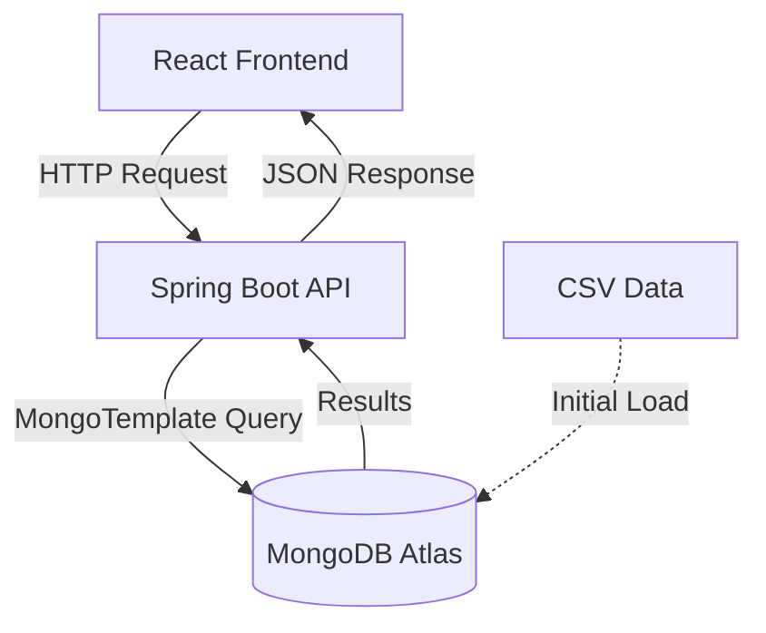

# SalesVista 📊


A retail sales dashboard showcasing enterprise-grade analytics with real-time search, filtering, sorting, and pagination capabilities for analyzing 734K+ sales transactions.

## 🎯 Why I Built This

To demonstrate the ability to build a production-ready full-stack application that handles large-scale data efficiently. This project showcases server-side processing, optimized database queries, and modern UI/UX design principles to create a responsive, performant analytics dashboard.

## ✨ Key Features

- **Real-time Search**: Case-insensitive regex matching across customer names and phone numbers
- **Advanced Filtering**: Multi-select filters for region, gender, category, payment method, and date ranges
- **Dynamic Sorting**: Server-side sorting on any column (ascending/descending)
- **Efficient Pagination**: Load only what's needed with server-side pagination
- **Responsive Design**: Clean, modern UI built with Tailwind CSS and custom components
- **Performance**: Sub-second query times on 734K+ records

## 🏗️ Architecture

High-level system architecture and data flow visualization available in [docs/architecture.md](./docs/architecture.md).



## 🛠️ Tech Stack

**Backend:**
- Java 17, Spring Boot 3, Spring Data MongoDB
- MongoTemplate for dynamic query construction
- Maven for dependency management

**Frontend:**
- React 19, Vite 7
- Tailwind CSS 4, Lucide React icons
- Axios for API communication

**Database:**
- MongoDB Atlas (Cloud) / MongoDB Community (Local)

**Deployment:**
- Frontend: Vercel
- Backend: Render (Docker container)

## 📊 Data Source

The application uses retail sales data from a publicly available CSV dataset containing 734K+ transaction records. The data includes fields like customer demographics, product categories, pricing, payment methods, and timestamps.

## 🚀 Search, Filter, Sort & Pagination

### Search
Server-side case-insensitive regex matching using `MongoTemplate` and `Criteria` on customer name and phone number fields simultaneously.

### Filtering
Dynamic `Criteria` construction supports multi-select filtering across multiple dimensions (region, gender, category, payment, date range) with logical OR within categories and AND across categories.

### Sorting
MongoDB native sort using `Sort` objects generated from client parameters (field + order), ensuring consistent ordering before pagination.

### Pagination
Strict server-side pagination with `skip()` and `limit()` - only requested data slices are fetched, keeping payloads small and UI responsive.

## 💡 Technical Challenges & Solutions

**Challenge 1: Performance with Large Dataset**
- **Problem**: Initial in-memory filtering/sorting caused slow response times (1.9 minutes) and high memory usage
- **Solution**: Migrated to MongoDB with `MongoTemplate` for database-level operations, achieving sub-second queries

**Challenge 2: Dynamic Filter Construction**
- **Problem**: Supporting flexible combinations of multi-select filters
- **Solution**: Built dynamic `Criteria` construction that combines multiple filter arrays with proper logical operators

**Challenge 3: MongoDB Atlas Free Tier Limits**
- **Problem**: 512MB storage limit required dataset truncation
- **Solution**: Disabled auto-indexing and optimized data import to fit ~700K records within constraints

## ⚡ Performance Optimizations

- **Database Indexing**: Strategic indexes on frequently queried fields (customerType, productLine, date)
- **Server-Side Processing**: All heavy operations (search, filter, sort, paginate) happen in MongoDB
- **Lazy Loading**: Pagination ensures only 20-50 records loaded at a time
- **Optimized Queries**: MongoTemplate aggregation pipelines minimize data transfer
- **CSV Import Optimization**: One-time data load on first startup with existence check

## 🚀 Setup Instructions

### Prerequisites
- Java 17+
- Maven 3.6+
- Node.js 18+ & npm
- MongoDB (Atlas or Local)

### Backend Setup

1. **Configure Database**
   - Update `backend/src/main/resources/application.properties`:
   ```properties
   spring.data.mongodb.uri=your-mongodb-connection-string
   spring.data.mongodb.database=sales-db
   ```

2. **Prepare Data**
   - Place `sales.csv` in `backend/src/main/resources/data/`
   - For MongoDB Atlas (512MB free tier): Truncate to ~700K records
   - Set `spring.data.mongodb.auto-index-creation=false` for Atlas

3. **Run Backend**
   ```bash
   cd backend
   mvn spring-boot:run
   ```
   - First run: Automatically imports CSV data (one-time process)
   - Server starts on: `http://localhost:8080`

### Frontend Setup

1. **Install Dependencies**
   ```bash
   cd frontend
   npm install
   ```

2. **Run Development Server**
   ```bash
   npm run dev
   ```
   - App available at: `http://localhost:5173`

## 🌐 Deployment

**Frontend (Vercel):**
- Automatic deployments from main branch
- Environment variables configured in Vercel dashboard

**Backend (Render):**
- Deployed as Docker container
- MongoDB Atlas connection string in environment variables
- Auto-redeploy on code changes

**Live Demo:** [Add your deployment URL here]

---

**Built with ❤️ by LoopMaster99**
