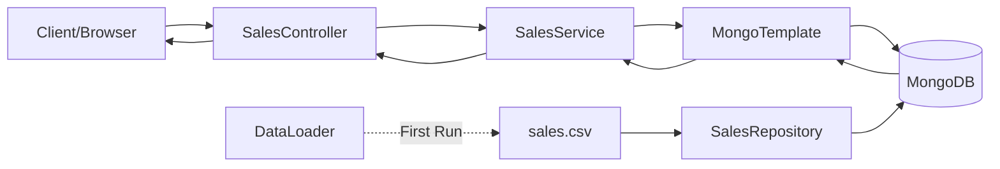
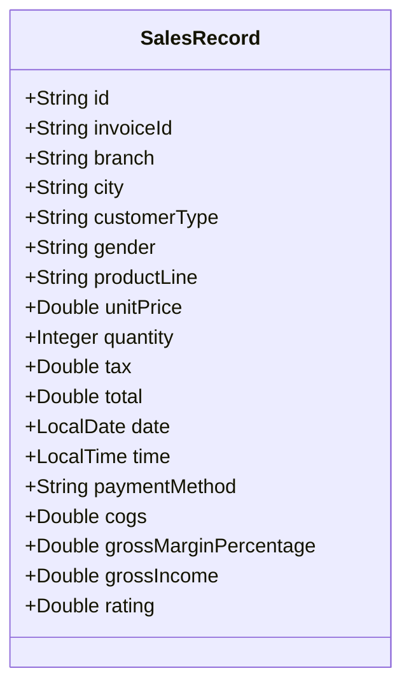

# Architecture Document

## 1. Backend Architecture

The backend is built using **Spring Boot 3** and **Java 17**, following a layered architecture:

*   **Controller Layer** (`com.app.controller`): Handles HTTP requests.
    *   `SalesController`: Exposes `/api/sales` endpoint.
*   **Service Layer** (`com.app.service`): Contains business logic.
    *   `SalesService`: Uses `MongoTemplate` to construct dynamic MongoDB queries and aggregations for filtering, sorting, and pagination.
*   **Data Layer** (`com.app.data`, `com.app.repository`):
    *   `SalesRepository`: Spring Data MongoDB repository for basic CRUD operations.
    *   `DataLoader`: Loads the CSV file into MongoDB on startup if the database is empty (`@PostConstruct`).
    *   `CsvParser`: Uses **Jackson CSV** to parse the `sales.csv` file.
*   **Model Layer** (`com.app.model`):
    *   `SalesRecord`: Maps 1:1 to MongoDB documents.
    *   `SalesQueryParams`: Captures search, filter, sort, and pagination parameters.

### Data Flow
1.  **Startup**: CSV -> `DataLoader` -> `SalesRepository` -> **MongoDB**.
2.  **Request**: Client -> `SalesController` -> `SalesService`.
3.  **Query**: `SalesService` constructs a MongoDB Query/Aggregation based on parameters.
4.  **Execution**: `MongoTemplate` executes the query against **MongoDB**.
5.  **Response**: Result -> `SalesController` -> JSON Response.



### Folder Structure
```
backend/
├── src/main/java/com/app/
│   ├── config/         # Configuration (CorsConfig)
│   ├── controller/     # REST Controllers
│   ├── data/           # Data Loading
│   ├── model/          # Entities & POJOs
│   ├── repository/     # Repositories
│   ├── service/        # Business Logic
│   └── util/           # Utilities (CsvParser)
```

## 2. Frontend Architecture

The frontend is a **React 18** application built with **Vite**.

*   **Framework**: React + Vite
*   **Styling**: Tailwind CSS + Custom "Shadcn-like" Components.
*   **State Management**: Local State (`useState`, `useEffect`) in `SalesPage`.
*   **Routing**: React Router DOM (Single page `/sales`).

### Module Responsibilities
*   **`components/ui`**: Reusable primitive components (Button, Input, Table, Select).
*   **`components`**: Layout components (`Layout`, `Sidebar`).
*   **`pages`**: formatting and business logic for specific views (`SalesPage`).
*   **`services`**: API communication (`api.js` uses **Axios**).
*   **`lib`**: Utilities (`cn` for class merging).

### Folder Structure
```
frontend/
├── src/
│   ├── components/
│   │   ├── ui/         # Atoms (Button, Input, etc.)
│   │   ├── Layout.jsx  # Main Layout
│   │   └── Sidebar.jsx # Navigation Sidebar
│   ├── pages/          # Views (SalesPage)
│   ├── services/       # API calls
│   ├── lib/            # Utils
│   └── App.jsx
```

## 3. Design Decisions
*   **MongoDB**: Selected for its flexibility and ability to handle large datasets efficiently. It replaces the initial in-memory sorting/filtering to improve scalability.
*   **MongoTemplate & Aggregation**: Used instead of simple repository methods to support complex, dynamic filtering conditions and efficient server-side calculations (e.g., total discounts).
*   **Tailwind CSS**: Used to match the provided Figma/Screenshot aesthetics accurately and quickly.

## 4. Database Schema

### SalesRecord Model



**Indexes:**
- `customerType`: For efficient filtering by customer segment
- `productLine`: For category-based queries
- `date`: For date range filtering
- Text index on `invoiceId` for search functionality

**Storage:** MongoDB collection named `sales_records` with ~734K documents.
